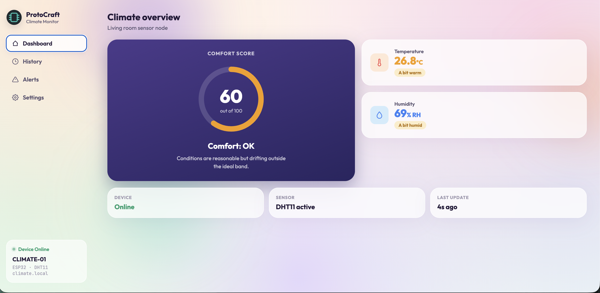
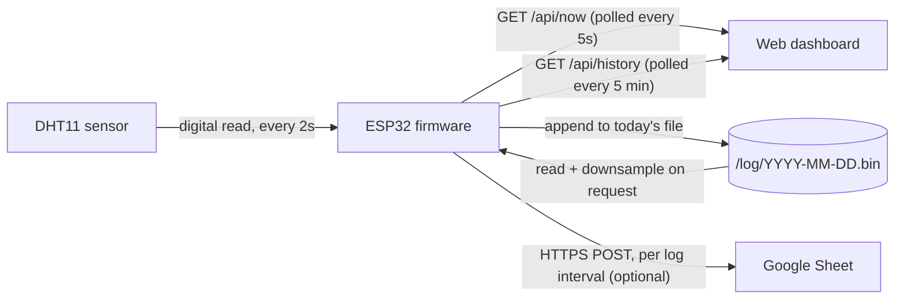

# ESP32 Home Climate Monitor (DHT11 + async multi-page dashboard)

An ESP32 reads temperature and humidity off a DHT11 and serves a live, color-coded dashboard on your local network. A Dashboard tab shows a comfort score and current readings, a History tab shows trend graphs with a configurable retention window, and a Settings tab handles WiFi and device info — reachable at `climate.local` without ever needing to know its IP address.



## What this is

- A multi-page dashboard (Dashboard / History / Alerts / Settings) with a sidebar on desktop and a bottom tab bar on mobile
- A local OLED readout — current temperature, humidity, and WiFi signal, no phone or network required to check it, plus a boot splash showing the channel logo
- A comfort score that turns temperature and humidity into one plain-language verdict (Great / OK / Poor), plus individual readings with color-coded status badges
- Configurable history: pick how long to keep data (1–30 days) and how often to log it (1 minute–1 hour), independently
- History survives a reboot and isn't capped by RAM — it's stored as small day-by-day files on flash, not a fixed-size buffer
- Chart view-range zoom — look at just today, the last few days, or everything currently retained, independent of how much is actually being kept
- Editable comfort thresholds and an alert feed showing when a reading last crossed from one tier to another
- No hardcoded WiFi credentials — connect it to your network the first time through a setup page it hosts itself
- Reachable at `http://climate.local`, no IP address hunting
- Change WiFi networks directly from the Settings tab, or fall back to a physical button (5-second hold) or the captive portal if the dashboard isn't reachable
- One-click CSV export of everything currently retained, at full resolution
- Optional background logging to a Google Sheet at whatever interval you've configured
- No app, no required cloud account. Open the dashboard in any browser on the same network.

## Architecture

Three layers, each one only aware of the layer directly below it.



**Sensor to firmware.** The DHT11 has no idea a webpage exists. The firmware reads it every 2 seconds and holds the current value; logging to flash happens on a separate, configurable interval.

**Firmware to webpage.** The firmware has zero opinions about color, layout, or what counts as "comfortable." It answers over plain HTTP: what's the reading right now, what's the (downsampled) history, and a full-resolution CSV. Every bit of presentation logic lives in the browser.

**History storage: day files, not a ring buffer.** This changed from an earlier version of this project, worth explaining because the reasoning is the interesting part.

The first version kept a fixed-size array of history points that got overwritten in place once full — a classic ring buffer. That works, but it caps how much history you can keep by how much RAM you're willing to spend (a few hundred KB at most on an ESP32), and flash was sitting there mostly unused despite having megabytes to spare.

The obvious fix — just make the ring buffer live on flash instead of RAM — turns out to be the wrong move. LittleFS (like most embedded flash filesystems) is fast at two things: appending to the end of a file, and deleting a whole file. It's genuinely slow at a third thing: overwriting data in the *middle* of an existing file, which is exactly what an in-place ring buffer does once it wraps around.

So instead, history is one small file per day — `/log/2026-08-22.bin`, `/log/2026-08-23.bin`, and so on. Every logged point gets appended to *today's* file only (the fast case). When a day ages past the configured retention, its whole file gets deleted (also the fast case). Nothing ever gets edited in place. This is what actually uses flash's real advantage — its size — without hitting the slow path.

**Downsampling on read, not on write.** Even with flash able to hold weeks of full-resolution data, dumping all of it into `/api/history` on every request would bloat the JSON response and choke the browser's chart redraw. So `/api/history` always reads across the day-files and returns a fixed 480 averaged points, regardless of whether the retention window is 1 day or 30 — chart performance stays constant either way. `/export.csv`, by contrast, streams the full, un-downsampled data file by file, since that's for your own analysis and full resolution is the point.

**Why two polling endpoints instead of one.** Current readings change every few seconds; history changes on whatever interval you've set, at minimum once a minute. Splitting them means the page only requests what's actually new.

**Why polling instead of websockets.** For data that moves this slowly, a persistent connection adds reconnect logic for no real benefit.

**Why the firmware loop never calls `delay()`.** The sensor read and the history log are both gated by comparing `millis()`/interval against a stored "last done at" time, not by blocking. The async server can answer a request the instant one comes in regardless of where `loop()` currently is. The WiFi connect attempt and NTP sync at boot are the one-time exception — startup steps, not something that runs while the dashboard is live.

**Why DHT11 reads are throttled to every 2 seconds.** The sensor's own datasheet asks for at least 1 second between reads; 2 seconds leaves margin.

**Why timestamps come from NTP, not `millis()`.** Seconds-since-boot would reset to zero on every reboot and break both the history graphs and the CSV export's date column. The sketch syncs to `pool.ntp.org` once at startup.

**The OLED is a fourth view, not a competing source of truth.** Same rule as the webpage: the display just reads `currentTemp`/`currentHum` and redraws after every sensor read, it doesn't maintain any state of its own. During setup mode it shows the access point name instead, so there's a way to check what's going on without a phone already in hand.

**WiFi setup: captive portal, not hardcoded credentials.** On first boot, or any time the saved network can't be reached, the ESP32 opens its own access point (`ProtoCraft-Setup`) with a DNS server that redirects any request to a setup page — this is what makes a phone auto-pop the "join this network" portal. Picking a network there saves the credentials to the ESP32's NVS and restarts into normal operation.

**Three doors into the same WiFi-credential storage.** The captive portal's `/connect`, the Settings tab's "Save & reconnect" (`/api/wifi`), and the "Forget WiFi network" reset (triggered from the dashboard, from the physical button, or automatically when a saved network can't be reached) all write to or clear the same NVS-backed storage through the same small set of functions. One source of truth, several ways to reach it, rather than parallel logic that could quietly drift apart.

**Why the cloud-logging POST is allowed to block, when nothing else is.** Pushing a reading to Google Sheets over HTTPS is the one blocking call in the whole sketch, and that's deliberate. It runs once per configured log interval, takes at most a second or two, and the dashboard stays fully responsive through it regardless, because `ESPAsyncWebServer` runs on its own task rather than depending on `loop()` to service it.

**Why cloud logging pins a real certificate instead of `setInsecure()`.** Nearly every ESP32-to-Google-Sheets tutorial skips TLS certificate validation entirely. This project ships a `google_root_ca.h.example` template instead — pinning the actual root CA means the board can tell a real Google server from anyone impersonating one. See [cloud logging setup](#cloud-logging-setup-optional).

**Viewing a range is not the same setting as keeping a range.** Retention (how long data is kept) and view range (how much of that shows on the chart right now) sound similar but answer different questions, so they're two separate controls rather than one. `/api/history` always downsamples to 480 points, but which slice of time those 480 points cover depends on an optional `?days=N` query param — "Today" and "Full retention" hit the exact same endpoint, just with a different range and therefore a different effective resolution per point. Only the day-files inside the requested range are opened; asking for "today" doesn't pay the cost of reading thirty files to use one of them.

**Alerts are a change-detector, not a log of every reading.** The obvious naive version writes an alert every time a value is outside the comfortable range, which on a slowly drifting sensor means dozens of near-duplicate entries for what's really one event. Instead, the firmware tracks the last known tier for temperature and humidity separately and only records something when that tier actually changes — comfortable to warning, warning to danger, danger back to comfortable, and so on. Checked on every 2-second sensor read, not tied to the logging interval, so a crossing gets caught quickly regardless of how sparse history logging is currently set to.

## Hardware

- ESP32 dev board
- DHT11 sensor
- Push button (momentary, normally-open)
- 1.3" 128x64 I2C OLED display, **SSD1306 driver** (not SH1106 — visually identical modules exist under both drivers and they're not code-compatible; check yours before assuming)
- Breadboard and jumper wires

### Wiring

| Component | Pin | ESP32 pin |
| --- | --- | --- |
| DHT11 | VCC | 3.3V |
| DHT11 | GND | GND |
| DHT11 | DATA | GPIO4 |
| Button | one leg | GPIO27 |
| Button | other leg | GND |
| Status LED | (most dev boards already have one) | GPIO2 |
| OLED | VCC | 3.3V |
| OLED | GND | GND |
| OLED | SDA | GPIO21 |
| OLED | SCL | GPIO22 |

If you're using a bare DHT11 (not a breakout module), add a 10k pull-up resistor between DATA and 3.3V — most breakout modules already include this.

The button uses the ESP32's internal pull-up (`INPUT_PULLUP`), no resistor needed. GPIO27 was picked over the board's BOOT button deliberately: BOOT is also a boot-mode strapping pin, and while holding it during normal operation is genuinely safe, a dedicated pin avoids that explanation and avoids confusion with the button already labeled BOOT.

If the OLED stays blank, it's most often the I2C address — try `0x3D` instead of `0x3C` (`OLED_I2C_ADDR` near the top of the sketch) before assuming a wiring fault.

## Libraries

Install through the Arduino IDE Library Manager:

- **DHT sensor library** by Adafruit
- **Adafruit Unified Sensor** by Adafruit
- **Adafruit GFX Library** by Adafruit
- **Adafruit SSD1306** by Adafruit
- **ESPAsyncWebServer** by ESP32Async
- **AsyncTCP** by ESP32Async
- **ArduinoJson** by Benoit Blanchon (v7)

`DNSServer`, `Preferences`, `ESPmDNS`, `HTTPClient`, `WiFiClientSecure`, and `Wire` ship with the ESP32 Arduino core.

Built with ESP32 Arduino core 3.x.

## Setup

1. Clone or download this folder and open `firmware/DHT11-Climate-Dashboard-v5-pre-automation/DHT11-Climate-Dashboard-v5-pre-automation.ino` in the Arduino IDE. `icon_bitmap.h` sits in the same folder as a second tab — the IDE loads it automatically, nothing to configure.
2. Copy `secrets.h.example` to `secrets.h`. WiFi credentials are not set here — this file only holds the optional Google Apps Script URL for cloud logging. Leave the placeholder if you don't want cloud logging.
3. For cloud logging, also copy `google_root_ca.h.example` to `google_root_ca.h` and follow the instructions inside it.
4. If you're not in India, change `GMT_OFFSET_SEC` near the top of the sketch.
5. Install the LittleFS uploader plugin for Arduino IDE 2.x: grab the latest `.vsix` from [earlephilhower/arduino-littlefs-upload](https://github.com/earlephilhower/arduino-littlefs-upload/releases), drop it in `~/.arduinoIDE/plugins/`, restart the IDE.
6. With the sketch folder open, upload the filesystem: `Ctrl+Shift+P` (`Cmd+Shift+P` on macOS) → **Upload LittleFS to Pico/ESP8266/ESP32**. This pushes `data/index.html` and `data/setup.html`.
7. Upload the sketch itself.
8. The board broadcasts **ProtoCraft-Setup**. Connect with your phone — a setup page should open automatically; if not, browse to `192.168.4.1`.
9. Pick your network, enter the password, tap Connect. The board restarts and joins it.
10. From then on, the dashboard is at **http://climate.local**. If mDNS doesn't resolve (see below), check the Serial Monitor at 115200 baud for the IP.

To move the board to a different network: the Settings tab has both **Save & reconnect** (switch to a specific new network directly) and **Forget WiFi network** (drop back into the captive portal to pick again). The physical button (5-second hold, LED blinks faster as you approach 5s) does the same as Forget WiFi, for when the dashboard itself isn't reachable.

**A real limitation worth knowing about:** `.local` addresses resolve natively on iOS, macOS, and most desktop Linux. Android's support is inconsistent across manufacturers and versions. If it doesn't work on your phone, the Serial Monitor IP address is the reliable fallback.

## API

**`GET /api/now`**
```json
{ "temp": 24.6, "hum": 52.3, "rssi": -58, "uptime": 4213, "ip": "192.168.1.47",
  "hostname": "climate.local", "ssid": "HomeWiFi_5G", "cloud_logging": true,
  "logging_enabled": true, "interval_sec": 300, "retention_days": 7 }
```
Polled every 5 seconds.

**`GET /api/history`**
```json
{ "interval_sec": 300, "retention_days": 7, "view_days": 7,
  "points": [ { "ts": 1755680400, "temp": 24.1, "hum": 55.0 }, ... ] }
```
Downsampled to at most 480 points regardless of range length. Optional `?days=N` (1 to current retention) narrows the view — omit it for the full retention window. Polled every 5 minutes, or on demand when the view-range buttons are clicked.

**`GET /export.csv`**
Streams the full, un-downsampled history across all retained day-files as `date,time,temp_c,humidity_pct`.

**`POST /api/settings`** (form-encoded, any subset of these fields)
```
interval_sec=300&retention_days=7&enabled=true
```
Updates logging interval (30–86400s), retention (1–90 days), and/or the logging-paused flag. Persisted to NVS; triggers an immediate retention cleanup pass.

**`POST /api/history/clear`** — deletes every day-file.

**`GET /api/thresholds`**
```json
{ "temp_comfort_min": 20, "temp_comfort_max": 26, "temp_warn_min": 17, "temp_warn_max": 35,
  "hum_comfort_min": 40, "hum_comfort_max": 60, "hum_warn_min": 25, "hum_warn_max": 95 }
```

**`POST /api/thresholds`** (form-encoded, any subset of the eight fields above) — updates comfort/warning boundaries, persisted to NVS. Also resets the alert system's last-known tier, so the next reading is compared against the new boundaries rather than a stale comparison against the old ones.

**`GET /api/alerts`**
```json
{ "events": [ { "ts": 1755680400, "metric": "T", "from_tier": 0, "to_tier": 1, "value": 27.3 }, ... ] }
```
Up to the last 50 tier-crossing events. `metric` is `T` or `H`; tiers are `0` (comfortable), `1` (warning), `2` (danger).

**`POST /api/wifi`** (form-encoded `ssid`, `pass`) — saves new credentials and restarts, without going through the captive portal.

**`POST /api/forget-wifi`** — clears saved credentials and restarts into setup mode.

During setup mode only: **`GET /scan`** (nearby networks) and **`POST /connect`** (form-encoded `ssid`, `pass` — saves and restarts).

## Cloud logging setup (optional)

Flash-backed history now covers real retention on its own (up to 30 days by default, adjustable up to 90), so cloud logging isn't the only way to get a permanent record anymore — but it's still the only way to get your data *off* the device: for backup independent of the board's health, for viewing from somewhere other than the local network, or for aggregating multiple sensor nodes into one place later.

1. Create a blank Google Sheet.
2. Extensions > Apps Script, paste in [`google-apps-script/Code.gs`](google-apps-script/Code.gs) from this repo.
3. Deploy > New deployment > **Web app** > Execute as **Me** > Who has access **Anyone** > Deploy. Copy the URL.
4. Paste it into `secrets.h` as `GOOGLE_SCRIPT_URL`.
5. Get the current root certificate for `script.google.com` and put it in `google_root_ca.h` — instructions are in `google_root_ca.h.example`; short version: `openssl s_client -connect script.google.com:443 -showcerts` and take the last certificate printed.
6. Reflash. The Serial Monitor prints `[cloud] logged` on each logging interval once it's working.

Cloud logging now runs at whatever interval you've set in the History tab, not a fixed 5 minutes — a faster interval means more Apps Script executions, worth keeping in mind against its free-tier daily quota if you set something aggressive.

The one-line shortcut, `WiFiClientSecure::setInsecure()`, skips certificate validation entirely and is what nearly every other tutorial uses. Fine for a quick personal project, not something to carry into anything more serious — see the architecture section above for the trade-off.

If you edit `Code.gs` later, create a new deployment (or update the existing one) for changes to take effect.

## Project history

| Stage | What it added |
| --- | --- |
| Base dashboard | DHT11 reading, async web server, gauges, comfort index |
| WiFi setup + mDNS | Captive portal provisioning, `climate.local`, physical + dashboard WiFi reset |
| CSV + cloud logging | CSV export, optional Google Sheets logging with a pinned root CA |
| Multi-page redesign | Sidebar/tab-bar navigation (Dashboard / History / Settings), configurable retention + interval, day-partitioned flash storage replacing the fixed RAM ring buffer, in-app WiFi network change |
| View range + Alerts | Chart view-range zoom independent of retention, an Alerts tab with editable comfort thresholds and a tier-crossing event feed |
| Local OLED display | On-device readout (temp, humidity, signal), boot splash with the channel logo, no phone/network required to check current conditions |

## Built with AI assistance

I'm a hardware engineer, not a web designer. The dashboard's visual design was built with Claude, and the firmware was scaffolded with AI assistance, then reviewed and adjusted by hand against how the ESP32 actually handles memory and flash.

Both prompts below have been kept up to date to match the current sketch and dashboard, with two deliberate exceptions in the firmware prompt: cloud logging to Google Sheets and the GPIO automation output are both left out, since those are the subject of a follow-up video.

<details>
<summary>Prompt: webpage design</summary>

```
Build a single-file HTML/CSS/JS multi-page dashboard (no framework, no build
step) for an ESP32-based home climate monitor reading temperature and
humidity from a DHT11 sensor. This page will be served as a static file from
the ESP32's flash storage, so it must be self-contained, lightweight, and use
no external dependencies except Chart.js (via cdnjs.cloudflare.com) for the
history graphs.

DESIGN DIRECTION
Do not use a dark navy/teal/orange "brand" palette. Instead, design something
colorful, modern, and attractive, closer to a consumer weather app than an
engineering tool: soft pastel gradient background (peach, pink, violet, sky,
mint), blurred color-blob accents, glass-morphism cards (semi-transparent
white, backdrop blur). Rounded corners, generous spacing, a friendly
sans-serif font (Outfit or similar via Google Fonts, with a system-font
fallback, plus a monospace font for IP/hostname-style values).

LAYOUT - four pages behind client-side navigation (no page reload), a
sidebar with nav links + a device-status card on desktop, collapsing to a
bottom tab bar on mobile (below ~768px):

- Dashboard: a hero card with a single circular SVG "comfort score" ring
  (0-100, big center number) and a one-line plain-language verdict (Great /
  OK / Poor) with a supporting sentence. Beside it, two smaller stat cards
  (Temperature, Humidity) with an icon, the current value, and a status
  badge (e.g. "Comfortable" / "A bit warm" / "Too hot"). Below that, a
  three-item footer strip: device online/offline, sensor model, and "last
  update Xs ago".
- History: data-logger controls (a "keep history for" dropdown [1/3/7/14/30
  days], a "log every" dropdown [1/5/15/30 min, 1 hour], pause/resume and
  clear-history buttons, a live estimate of raw storage size and effective
  chart resolution given the current picks, and a CSV download button), a
  row of view-range buttons (Today / 3 days / 7 days / Full retention) that
  are independent of the logging settings above, and two separate Chart.js
  line charts - "Temperature history" and "Humidity history" - each with a
  gradient fill under the line.
- Alerts: editable min/max threshold fields for temperature and humidity
  comfort/warning bands, a save button, and a reverse-chronological list of
  logged tier-crossing events (metric, old tier -> new tier, value,
  timestamp).
- Settings: a WiFi card (current SSID, fields to enter a new
  network+password with a "Save & reconnect" button, and a "Forget WiFi
  network" button) and a read-only device-info card (IP, hostname, sensor,
  uptime as HH:MM:SS, signal in dBm, cloud-logging enabled/disabled).

COMFORT / STATUS COLOR LOGIC
Discrete three-tier coloring (comfortable / warning / danger), not a
continuous gradient - driven by the same threshold fields the Alerts page
edits, defaulting to: temperature comfortable 20-26°C, warning 17-35°C,
danger outside that; humidity comfortable 40-60%, warning 25-95%, danger
outside that. The comfort ring's color and its 0-100 score are derived by
averaging a fixed score per tier (good=100, warn=60, bad=20) across
temperature and humidity - color the ring green at 85+, amber at 55-84, red
below that. Each stat card's own color and badge text use that metric's own
tier independently, so e.g. temperature can read "Comfortable" while
humidity reads "A bit humid" at the same time.

DATA SOURCE
The page has no simulated or hardcoded data. It fetches from JSON endpoints
on the same host, all under /api/, plus a plain-text CSV download:

GET /api/now
  { "temp": 24.6, "hum": 52.3, "rssi": -58, "uptime": 4213, "ip": "192.168.1.47",
    "hostname": "climate.local", "ssid": "HomeWiFi_5G", "cloud_logging": true,
    "logging_enabled": true, "interval_sec": 300, "retention_days": 7 }
  temp/hum may be null if a sensor read hasn't succeeded yet. Poll every 5
  seconds. Drive the comfort ring, both stat cards, the footer/device-info
  fields, and (once, on first response) seed the History page's dropdowns
  and view-range buttons from interval_sec/retention_days without
  overwriting whatever the user has since changed on screen.

GET /api/history?days=N (days omitted = full retention window)
  { "interval_sec": 300, "retention_days": 7, "view_days": 7,
    "points": [ { "ts": 1755680400, "temp": 24.1, "hum": 55.0 }, ... ] }
  ts is a Unix timestamp in seconds; format as local HH:MM for a single-day
  view, or "DD/MM HH:MM" once the view spans more than one day. Poll once on
  load, every 5 minutes after, and immediately whenever a view-range button
  is clicked. Replace both charts' data entirely on each fetch, don't append.

GET /api/thresholds - the eight threshold values, used to populate the
Alerts page's fields and to color the Dashboard.
POST /api/thresholds (form-encoded, same eight fields) - save button on the
Alerts page.
GET /api/alerts - { "events": [ { "ts", "metric": "T"|"H", "from_tier",
  "to_tier", "value" }, ... ] }, fetched when the Alerts page is opened.
POST /api/settings (form-encoded interval_sec / retention_days / enabled) -
  the History page's Apply button and Pause/Resume toggle.
POST /api/history/clear - the History page's Clear button, behind a
  confirm() since it's destructive.
GET /export.csv - the Download CSV button just navigates the browser here.
POST /api/wifi (form-encoded ssid, pass) - Settings page's Save & reconnect,
  behind a confirm() since the device restarts.
POST /api/forget-wifi - Settings page's Forget WiFi network, behind a
  confirm() since it drops back into the captive portal.

If a polling fetch fails, show a visibly different connection state (e.g.
the status dot turns red and the status text changes to "Reconnecting…")
rather than silently going stale, and recover automatically once a fetch
succeeds again.

Responsive down to a 360px-wide mobile screen. No localStorage/sessionStorage.
```

</details>

<details>
<summary>Prompt: firmware</summary>

```
Write an Arduino sketch for an ESP32 that reads a DHT11 sensor and serves a
multi-page web dashboard and JSON API over WiFi, using an async web server so
multiple browser tabs/devices can load it at once without blocking each other
or the sensor loop.

HARDWARE
- DHT11 data pin on GPIO4 (adjustable). If it's a bare DHT11 (not a breakout
  module), note that it needs a 10k pull-up resistor to 3.3V.
- Push button on GPIO27 to GND (internal pull-up, no resistor needed). Hold
  5 seconds to forget the saved WiFi network and drop back into setup mode.
- Status LED on GPIO2, used purely as hold-progress feedback for that button
  (blink rate increases as the 5-second hold approaches).
- 1.3" 128x64 I2C OLED, SSD1306 driver (not SH1106 - visually identical
  modules exist under both drivers and aren't code-compatible, so call this
  out), on the default I2C pins (SDA=GPIO21, SCL=GPIO22), address 0x3C
  (fall back to 0x3D if the display doesn't initialize).
- No hardcoded WiFi credentials anywhere in the sketch - see WIFI SETUP
  below for how the network gets configured instead.

LIBRARIES
DHT sensor library + Adafruit Unified Sensor (Adafruit), Adafruit GFX Library
+ Adafruit SSD1306 (Adafruit), ESPAsyncWebServer + AsyncTCP (ESP32Async),
ArduinoJson v7, LittleFS, WiFi.h, DNSServer, Preferences, ESPmDNS, time.h,
Wire.h. Target ESP32 Arduino core 3.x.

WIFI SETUP - captive portal, not hardcoded credentials
On first boot, or any time the previously-saved network can't be reached,
the ESP32 should open its own access point ("ProtoCraft-Setup") with a DNS
server that redirects any request to a setup page, so a phone auto-pops the
"join this network" portal. That page scans for nearby networks, lets the
user pick one and enter a password, and on submit saves the credentials to
NVS (via Preferences) and restarts into normal station-mode operation.
Provide three doors into that same saved-credential storage, all going
through the same small set of functions rather than parallel logic: the
captive portal itself, a "change network" action reachable from the running
dashboard's Settings tab, and a "forget this network" action reachable both
from the dashboard and from the physical button's 5-second hold.

BEHAVIOR
- Read the DHT11 every 2 seconds (not faster — the sensor needs at least 1
  second between reads). Keep the last known-good reading if a read fails,
  don't null it out.
- Sync time via NTP once at startup (configurable GMT offset constant near
  the top of the file, clearly commented so it's easy to change for a
  different timezone). Timestamps for history should be real Unix time, not
  seconds-since-boot, so they survive a reboot correctly.
- Store history as one small file per day (e.g. /log/2026-08-22.bin) rather
  than a single fixed-size ring buffer file - every logged point gets
  appended to today's file only, and once a day ages past a configurable
  retention window (default 7 days, adjustable 1-90), its whole file gets
  deleted. Both appending and whole-file deletion are the fast operations on
  a flash filesystem like LittleFS; overwriting data in the middle of an
  existing file is the slow one, which is exactly what an in-place ring
  buffer does once full - so avoid that pattern entirely. Store points as a
  compact binary struct (timestamp + temp*10 and humidity*10 as int16), not
  as JSON, to keep files small and avoid parsing overhead.
- Logging interval and retention window are both runtime-configurable
  (persisted to NVS), not compile-time constants - interval from 30 seconds
  to 24 hours, retention from 1 to 90 days. A separate boolean can pause
  logging entirely without losing the saved settings.
- No delay() calls anywhere in loop(), except the handful of one-time
  startup steps (WiFi connect attempt, NTP sync, boot splash) where nothing
  else needs to run yet. Both the sensor-read interval and the history-log
  interval should be gated by comparing millis() against a stored "last done
  at" timestamp, so the loop never blocks and the async server can respond
  to requests immediately regardless of where loop() currently is.
- Track a simple threshold-based comfort tier (comfortable / warning /
  danger) for temperature and humidity independently, using editable
  min/max boundaries persisted to NVS. Record an event only when a reading's
  tier actually changes (not on every out-of-range reading, which would spam
  near-duplicate entries on a slowly drifting sensor) - keep the last N of
  these in a small ring buffer that's fine to persist to flash on every
  write, since tier changes are rare by nature.
- Serve the multi-page dashboard from LittleFS at "/" (the frontend is a
  separate deliverable, assume a data/ folder with the page files already
  exists and gets uploaded to LittleFS separately, don't embed HTML in the
  sketch).
- OLED is a fourth, independent view of the same state the webpage reads -
  it doesn't maintain any state of its own. On boot, before WiFi even
  attempts to connect, show a one-time splash screen (logo + wordmark) for
  a couple of seconds - this is the one place a blocking delay() is fine,
  since it only runs once at startup. During setup mode, show the access
  point name instead of the normal status screen, so there's a way to check
  what's going on without a phone already in hand. Otherwise redraw the
  status screen after every successful sensor read (same 2-second cadence as
  the DHT11 read, not a separate timer): current temperature, current
  humidity, and a WiFi signal-strength indicator (bars, derived from RSSI).
  If the display fails to initialize, log it and continue running everything
  else normally - the OLED is a nice-to-have, not a dependency for the rest
  of the sketch.

API (must match exactly, a separate frontend depends on this contract)

GET /api/now
  Returns: { "temp": <float or null>, "hum": <float or null>, "rssi": <int>,
  "uptime": <seconds since boot>, "ip": "<local IP as string>",
  "hostname": "climate.local", "ssid": "<connected SSID>",
  "logging_enabled": <bool>, "interval_sec": <int>, "retention_days": <int> }
  temp/hum are null if no successful read has happened yet.

GET /api/history?days=<N> (optional, 1 to current retention; omit for the
full retention window)
  Returns: { "interval_sec": <int>, "retention_days": <int>,
  "view_days": <int>, "points": [ { "ts": <unix seconds>, "temp": <float>,
  "hum": <float> }, ... ] }
  Always downsample to a fixed number of averaged points (e.g. 480)
  regardless of the requested range, so the response size and chart redraw
  cost stay constant whether the range is one day or the full retention
  window. Only open the day-files the requested range actually needs.

GET /export.csv
  Streams the full, un-downsampled history across all retained day-files as
  "date,time,temp_c,humidity_pct", one day-file at a time, without holding
  more than one record in memory at once.

POST /api/settings (form-encoded, any subset)
  interval_sec, retention_days, enabled - updates the logging config,
  persists to NVS, and triggers an immediate retention cleanup pass.

POST /api/history/clear
  Deletes every day-file.

GET /api/thresholds
  Returns the eight comfort/warning boundary values (temp and humidity,
  each with a comfort min/max and a warn min/max).

POST /api/thresholds (form-encoded, any subset of those eight fields)
  Updates the boundaries and persists to NVS. Also resets whatever tier was
  last recorded for temperature and humidity, so the very next reading is
  compared against the new boundaries rather than a stale comparison against
  the old ones.

GET /api/alerts
  Returns up to the last 50 tier-crossing events (timestamp, which metric,
  from-tier, to-tier, value).

POST /api/wifi (form-encoded ssid, pass)
  Saves new credentials through the same storage the captive portal uses,
  and restarts - lets the dashboard switch networks without going through
  the portal.

POST /api/forget-wifi
  Clears saved credentials and restarts into setup mode.

During setup mode only:
GET /scan - nearby networks, as JSON.
POST /connect (form-encoded ssid, pass) - saves and restarts.

Comment the code to explain: why history is one file per day instead of an
in-place ring buffer, why the sensor read interval is 2 seconds, why
timestamps come from NTP rather than millis(), why the OLED redraws on the
sensor-read cadence rather than its own timer, and why alerts are recorded
only on a tier change rather than on every out-of-range reading.
```

</details>

## License

Code: MIT. Hardware/wiring notes: CC BY 4.0. See the repository root for full license text.
