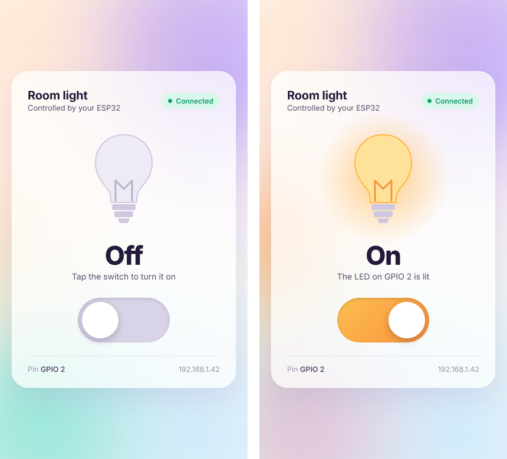
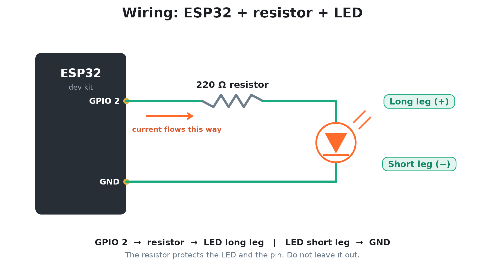

# ESP32 Web LED Switch

Turn an LED on and off from your phone. The ESP32 joins your WiFi, hosts its own small web page, and the LED on GPIO 2 follows the switch you tap on that page.

You do not need any coding experience. If you can follow the steps below, you can build this. It takes about 30 minutes the first time, including software setup.



Part of the **ProtoCraft Electronics** ESP32 Foundation series. No extra libraries to install: WiFi and WebServer come with the ESP32 board package.

## Contents

- [Quick start](#quick-start)
- [What you need](#what-you-need)
- [How it works](#how-it-works)
- [Step 1: Wire it up](#step-1-wire-it-up)
- [Step 2: Install the software](#step-2-install-the-software)
- [Step 3: Get the code](#step-3-get-the-code)
- [Step 4: Add your WiFi details](#step-4-add-your-wifi-details)
- [Step 5: Upload to the ESP32](#step-5-upload-to-the-esp32)
- [Step 6: Find the address in the Serial Monitor](#step-6-find-the-address-in-the-serial-monitor)
- [Step 7: Open the web page](#step-7-open-the-web-page)
- [Check that it works](#check-that-it-works)
- [Understand the code](#understand-the-code)
- [Try the web addresses by hand](#try-the-web-addresses-by-hand)
- [Troubleshooting](#troubleshooting)
- [Try it yourself](#try-it-yourself)
- [Glossary](#glossary)
- [Known simplifications](#known-simplifications)
- [Files in this folder](#files-in-this-folder)

## Quick start

For people who have used an ESP32 before.

1. Wire GPIO 2 to a 220 ohm resistor, then to the LED long leg. Wire the LED short leg to GND.
2. Install the ESP32 board package (3.x) in the Arduino IDE.
3. Copy `firmware/esp32_web_led_switch/secrets.h.example` to `secrets.h` and enter your 2.4 GHz WiFi name and password.
4. Select **ESP32 Dev Module**, upload, and open the Serial Monitor at **115200** baud.
5. Open the `http://` address it prints, from a phone or laptop on the same WiFi.

If any of that was unfamiliar, read on. Every step is explained below.

## What you need

### Parts

| Qty | Part | Notes |
|---|---|---|
| 1 | ESP32 dev kit (WROOM) | Any common 30 or 38 pin dev board. The ESP32 Arduino core v3.x is recommended. |
| 1 | LED | Red, yellow or green works best. Blue and white LEDs look dimmer on 3.3 V. |
| 1 | 220 ohm resistor | 330 ohm also works. Do not skip it. |
| 1 | Breadboard | Half size is enough. |
| 2 | Jumper wires | Male to male. |
| 1 | USB cable | It must carry data. Some cables only charge, and those will not work. |

You also need a computer (Windows, macOS or Linux), a phone or laptop on the same WiFi network, and a 2.4 GHz WiFi network. The ESP32 cannot join 5 GHz networks.

### Software (free)

- **Arduino IDE 2.x**, from [arduino.cc/en/software](https://www.arduino.cc/en/software)
- **ESP32 board package** for the Arduino IDE (installed in Step 2)

### Safety

This project switches a small LED only. Do not connect a mains (wall power) lamp to the ESP32. Switching mains power needs a proper relay module and careful wiring, and it is not covered here.

## How it works

Read this once. It makes the rest of the steps easier to follow.

```
 Phone browser  -->  WiFi router  -->  ESP32  -->  GPIO 2  -->  LED
```

1. The ESP32 joins your home WiFi, the same way your phone does.
2. Your router gives the ESP32 an address, called an **IP address**, for example `192.168.1.42`.
3. When you type that address into a browser, the browser asks the ESP32 for a page. The ESP32 answers with the Room light page. The page is stored inside the ESP32's program.
4. When you tap the switch, the page sends a tiny request back to the ESP32, such as "turn on".
5. The ESP32 sets GPIO 2 high (3.3 V) or low (0 V). The LED turns on or off.
6. The ESP32 replies with the new state, and the page redraws the switch to match.

The ESP32 is the **web server**. Your phone or laptop is the **client**.

## Step 1: Wire it up



The circuit has four parts in one loop: GPIO 2, the resistor, the LED, and GND.

| From | To |
|---|---|
| GPIO 2 pin | One leg of the 220 ohm resistor |
| Other leg of the resistor | LED **long leg** (the anode, marked +) |
| LED **short leg** (the cathode, marked −) | GND pin |

### Which LED leg is which

The long leg is positive. The short leg is negative. Many LEDs also have a flat edge on the plastic rim, and that side is the negative leg. An LED only works one way round. If it stays dark later, flip it around first.

### Breadboard basics

On a breadboard, the five holes in one short row (a to e, or f to j) are connected under the plastic. Holes in different rows are not connected.

A worked example, using made-up row numbers:

1. Put one resistor leg in **row 10** and the other leg in **row 14**.
2. Put the LED long leg in **row 14** (same row as the resistor's second leg) and the short leg in **row 15**.
3. Jumper wire 1: from the GPIO 2 pin of the ESP32 to **row 10**.
4. Jumper wire 2: from **row 15** to a GND pin of the ESP32.

Find the pins by the labels printed on your board. GPIO 2 may be printed as `D2` or `IO2`. Boards have more than one GND pin, and any of them works.

If your ESP32 sits on the breadboard, each pin shares a row with the holes beside it. Use the free holes on the outer side of the board, so your wires do not share a row by accident.

### Before you plug in

- The resistor is in the circuit. It is not skipped.
- The resistor legs are in different rows. The same goes for the two LED legs.
- The LED long leg is on the resistor side. The short leg goes to GND.
- Nothing connects 3.3 V or 5 V directly to the LED.

**Why the resistor matters.** With a resistor, a typical red LED draws about 6 mA from GPIO 2, which is gentle. Without one, the LED pulls far more current than the pin is meant to give. That can damage the LED and the ESP32 pin.

**Onboard LED.** Many dev kits already have a small LED built in on GPIO 2. It will blink together with your external LED. That is normal.

## Step 2: Install the software

### 1. Install the Arduino IDE

Download **Arduino IDE 2.x** from [arduino.cc/en/software](https://www.arduino.cc/en/software) and install it with the default options.

### 2. Add ESP32 support

The Arduino IDE does not know the ESP32 until you add its board package.

1. Open the preferences. On Windows and Linux: **File > Preferences**. On macOS: **Arduino IDE > Settings**.
2. Find the box called **Additional boards manager URLs** and paste this line into it:

   ```
   https://espressif.github.io/arduino-esp32/package_esp32_index.json
   ```

3. Click **OK**.
4. Open the Boards Manager: **Tools > Board > Boards Manager**, or the board icon in the left sidebar.
5. Search for `esp32`. Install the package named **esp32 by Espressif Systems**. Version 3.x is recommended.
6. Restart the Arduino IDE when the install finishes.

The download is large, so it can take a few minutes.

### 3. Install the USB driver (only if needed)

Plug the ESP32 into your computer with the USB cable. Open **Tools > Port**. If a new port appears, for example `COM3` on Windows or `/dev/cu.usbserial-0001` on macOS, skip this part.

If no new port appears, your board's USB chip needs a driver:

- Boards with a **CP2102** chip: [Silicon Labs CP210x driver](https://www.silabs.com/software-and-tools/usb-to-uart-bridge-vcp-drivers)
- Boards with a **CH340** chip: search for "CH340 driver" for your operating system

The chip name is printed on a small square chip near the USB socket. Also try a different USB cable, since charge-only cables do not show a port.

## Step 3: Get the code

Pick one way.

**Without Git (easiest):**

1. Open the [ProtoCraft-Electronics repository](https://github.com/ProtoCraft-Electronics/ProtoCraft-Electronics).
2. Click the green **Code** button, then **Download ZIP**.
3. Unzip it. Open the folder `ESP32-Projects/esp32-web-led-switch/`.

**With Git:**

```
git clone https://github.com/ProtoCraft-Electronics/ProtoCraft-Electronics.git
```

Inside the project folder, the Arduino sketch is here:

```
firmware/esp32_web_led_switch/esp32_web_led_switch.ino
```

Keep the folder name and the `.ino` file name the same. The Arduino IDE requires that.

## Step 4: Add your WiFi details

Your WiFi name and password live in a separate file called `secrets.h`. That keeps them out of the main code, and out of GitHub if you copy this project to your own repository.

1. Open the folder `firmware/esp32_web_led_switch/`.
2. Make a copy of `secrets.h.example`.
3. Rename the copy to exactly `secrets.h`.
4. Open `secrets.h` in any text editor and fill in your details:

```cpp
#define WIFI_SSID     "YOUR_WIFI_NAME"
#define WIFI_PASSWORD "YOUR_WIFI_PASSWORD"
```

For example:

```cpp
#define WIFI_SSID     "HomeWiFi"
#define WIFI_PASSWORD "my-secret-password"
```

Rules to follow:

- Keep the double quotes.
- Type the name and password exactly, including capital letters.
- Use your **2.4 GHz** network. If your router shows two names, such as `HomeWiFi` and `HomeWiFi_5G`, use the one without 5G.
- `secrets.h` must sit in the same folder as `esp32_web_led_switch.ino`.

**Windows tip:** by default, Windows hides file extensions. A file you think is called `secrets.h` may really be `secrets.h.txt`. In File Explorer, open the **View** menu, choose **Show**, and tick **File name extensions**. Then check the name again.

When you open the sketch in the Arduino IDE, `secrets.h` appears as a second tab next to the main sketch.

## Step 5: Upload to the ESP32

1. Open `esp32_web_led_switch.ino` in the Arduino IDE.
2. Choose the board: **Tools > Board > esp32 > ESP32 Dev Module**.
3. Choose the port: **Tools > Port**, then pick the new port that appeared when you plugged the board in.
4. Click the **Upload** button, the right-pointing arrow at the top left.
5. Wait. The IDE compiles first, which can take a minute. Then it uploads. The bottom panel shows `Done uploading` when it finishes.

**If the output says `Connecting......` and then fails:** press and hold the **BOOT** button on the ESP32 while the dots are showing. Let go when the upload percentage starts to move. Then try again.

## Step 6: Find the address in the Serial Monitor

The Serial Monitor is a window where the ESP32 prints messages to your computer.

1. Open it: **Tools > Serial Monitor**, or the magnifying glass icon at the top right.
2. At the bottom right of the panel, set the speed to **115200 baud**.
3. If the window is empty, press the **EN** (reset) button on the ESP32 so it starts again.

You should see something like this:

```
Connecting to HomeWiFi.......
Connected. Open http://192.168.1.42 in your browser.
Web server started.
```

The number of dots differs each time. **Your address will be different** from `192.168.1.42`. Use the one your board prints.

If you see garbled characters, the speed is wrong. Set it to 115200.

## Step 7: Open the web page

1. On a phone or laptop that is on the **same WiFi network**, open a browser.
2. Type the address from the Serial Monitor into the address bar. Start with `http://`, for example `http://192.168.1.42`. Do not use `https://`.
3. The Room light page opens. Tap the switch.

The LED turns on. Tap again and it turns off. The Serial Monitor prints `LED ON` and `LED OFF` each time.

Your phone must use WiFi, not mobile data. Mobile data cannot reach a device inside your home network.

Your router may give the ESP32 a different address after a restart. If the page stops opening one day, check the Serial Monitor for the new address.

## Check that it works

| Check | What you should see |
|---|---|
| Serial Monitor after reset | `Connected. Open http://... in your browser.` |
| Page opens on the phone | The Room light card with a green **Connected** label |
| Tap the switch | The bulb glows, the page says **On**, the LED lights |
| Tap again | The page says **Off**, the LED goes dark |
| Refresh the page while the LED is on | The page still says **On** |
| Open the page on a second device | It shows the same state as the LED |

The last two rows work because the page asks the ESP32 for the real state every time it loads. The page does not guess.

## Understand the code

You do not need to read the code to use the project. If you want to, this section explains it in plain steps. The file is `firmware/esp32_web_led_switch/esp32_web_led_switch.ino`.

### The top of the file

```cpp
#include <WiFi.h>
#include <WebServer.h>
#include "secrets.h"
```

These lines load ready-made code. `WiFi.h` handles the WiFi connection. `WebServer.h` handles web requests. Both come with the ESP32 board package. `secrets.h` is your own file with the WiFi name and password.

```cpp
const uint8_t LED_PIN = 2;
const uint32_t WIFI_TIMEOUT_MS = 20000;
WebServer server(80);
bool ledOn = false;
```

- `LED_PIN` is the pin the LED is wired to.
- `WIFI_TIMEOUT_MS` is how long to wait for WiFi, in milliseconds. 20000 is 20 seconds.
- `server(80)` creates the web server. Port 80 is the normal port for web pages.
- `ledOn` remembers whether the LED is on right now.

### The web page

```cpp
const char PAGE[] PROGMEM = R"rawliteral( ... )rawliteral";
```

The whole web page (HTML, styling and a little JavaScript) is stored as one block of text inside the program. That is why there is nothing extra to upload to the ESP32. When a browser asks for the page, the ESP32 sends this text.

### Answering requests

```cpp
server.on("/", HTTP_GET, handleRoot);
server.on("/api/led", HTTP_GET, handleLed);
```

These two lines say: when someone asks for `/`, run `handleRoot`, which sends the page. When someone asks for `/api/led`, run `handleLed`, which checks or changes the LED.

Inside `handleLed`, the important part is:

```cpp
if (server.hasArg("state")) {
  ledOn = (server.arg("state") == "1");
  digitalWrite(LED_PIN, ledOn ? HIGH : LOW);
}
```

If the request includes `state=1`, the LED turns on. If it includes `state=0`, the LED turns off. After that, the ESP32 replies with `{"on":true}` or `{"on":false}`, so the page knows the real state.

### Joining WiFi

```cpp
WiFi.mode(WIFI_STA);
WiFi.begin(WIFI_SSID, WIFI_PASSWORD);
```

`WIFI_STA` means the ESP32 acts like a normal device joining your router, like a phone. `WiFi.begin` starts the connection with your name and password. The code then prints a dot every 0.4 seconds while it waits. If 20 seconds pass without success, it prints a message, waits 5 seconds, and restarts. That way a typo in the password never leaves the board stuck.

### setup() and loop()

Every Arduino program has these two parts.

- `setup()` runs once, when the board starts. It sets the pin as an output, joins WiFi, and starts the web server.
- `loop()` runs over and over, forever. Here it only does one thing: `server.handleClient();`. That checks whether anyone is asking for something, and answers.

### The page and the board stay in sync

When the page loads, the last line of its script calls `load()`. That asks the ESP32 `/api/led` for the real state, then draws the switch to match. This is why a refresh, or a second phone, always shows the truth. The ESP32 holds the real state. The page only displays what it is told.

## Try the web addresses by hand

You can control the LED without the page. Type these into your browser's address bar, with your own address:

| Address | What happens |
|---|---|
| `http://192.168.1.42/` | The page opens |
| `http://192.168.1.42/api/led` | Shows the current state, for example `{"on":true}` |
| `http://192.168.1.42/api/led?state=1` | The LED turns on |
| `http://192.168.1.42/api/led?state=0` | The LED turns off |

This is how the page works behind the scenes. Tapping the switch just opens one of these addresses for you.

## Troubleshooting

### Computer and upload

| Symptom | Likely cause and fix |
|---|---|
| No new port under Tools > Port | The USB cable is charge-only, or the driver is missing. Try another cable first, then see the driver part of [Step 2](#step-2-install-the-software). |
| Upload stops at `Connecting......` or says `Failed to connect to ESP32` | Hold the **BOOT** button while the dots show, and let go when the upload starts. Also check the port and the cable. As a last resort, unplug the wire from GPIO 2 during the upload and plug it back afterwards. |
| Error: `secrets.h: No such file or directory` | You have not made `secrets.h` yet, or it is in the wrong folder. It must sit next to the `.ino` file. See [Step 4](#step-4-add-your-wifi-details). |
| Error: `WebServer.h: No such file or directory` | The ESP32 board package is not installed, or a different board (such as an Arduino Uno) is selected. Redo [Step 2](#step-2-install-the-software) and choose **ESP32 Dev Module**. |
| Serial Monitor shows strange characters | The speed is wrong. Set it to **115200 baud**. |
| Serial Monitor is empty | Press the **EN** button on the ESP32. Check the right port is selected. |

### WiFi

| Symptom | Likely cause and fix |
|---|---|
| Dots, then `WiFi timed out` | Wrong WiFi name or password in `secrets.h`, or the network is 5 GHz only. The ESP32 supports 2.4 GHz only. Check spelling and capital letters. The board restarts and tries again by itself. |
| It works at home but not at a friend's place or office | Some networks block new devices, or ask for a login page first. Use your own home network. |

### The web page

| Symptom | Likely cause and fix |
|---|---|
| The page does not open | The phone is on mobile data, or on a different network. Turn off mobile data and join the same WiFi. A guest network often blocks devices from talking to each other. |
| Browser says the connection is not secure, or shows a blank error | Use `http://`, not `https://`. |
| The page worked yesterday and not today | The router gave the ESP32 a new address. Reset the board and read the new address in the Serial Monitor. |
| The label at the top says **Offline** | The ESP32 lost power or WiFi. Check the USB cable and the Serial Monitor, then press **EN**. |
| The font looks different from the screenshots | The page loads the Outfit font from Google Fonts. Without internet access it uses your device's font. Everything still works. |

### The LED

| Symptom | Likely cause and fix |
|---|---|
| The Serial Monitor prints `LED ON` but the LED stays dark | Check the wiring. The LED is probably the wrong way round, so flip it. Also check that the resistor legs and LED legs are in different rows. |
| The onboard LED lights but yours does not | Same as above: the wiring to your external LED is the problem. The code works. |
| Neither LED lights and no `LED ON` message appears | The page cannot reach the board. Check the address and that the label says **Connected**. |
| The LED is very dim | Blue and white LEDs need more voltage than 3.3 V gives through a resistor. Use a red, yellow or green LED. |

## Try it yourself

Small changes that teach you something. Change one thing at a time and upload again.

1. **Rename the page.** Search for `Room light` in the sketch and change it to `Desk lamp`.
2. **Use a different pin.** Change `LED_PIN` to `4`, move your jumper wire to GPIO 4, and upload. Avoid GPIO 6 to 11, which the board uses for its flash memory, and GPIO 34 to 39, which can only read inputs.
3. **Change the timeout.** Make `WIFI_TIMEOUT_MS` 10000 and see how the failure looks with a wrong password.
4. **Add a second LED.** Give it its own pin and a new route such as `/api/led2`, copying how `handleLed` works.
5. **Remember the state after a restart.** Look up the ESP32 `Preferences` library and save `ledOn` to it.

## Glossary

| Word | Meaning |
|---|---|
| ESP32 | A small, cheap computer chip with built-in WiFi, made by Espressif |
| Dev kit | The ESP32 chip soldered onto a board with a USB socket and pins, so it is easy to use |
| GPIO | General Purpose Input/Output. A pin on the board that your program can turn on and off, or read |
| High / low | A pin at 3.3 V is high. A pin at 0 V is low |
| LED | A small light that works in one direction only |
| Resistor | A part that limits electric current. Here it protects the LED and the pin |
| Breadboard | A board with holes for building circuits without soldering |
| Router | The box that provides WiFi in your home |
| 2.4 GHz | One of the two WiFi bands. The ESP32 only uses this one |
| IP address | The number that identifies a device on your network, like `192.168.1.42` |
| Web server | A program that answers requests from web browsers. Here, it runs on the ESP32 |
| Browser | The app you use to open web pages, such as Chrome or Safari |
| HTTP | The set of rules browsers and web servers use to talk to each other |
| Route | One address a web server answers, such as `/` or `/api/led` |
| API | A set of addresses a program can use to ask another program for data or actions |
| JSON | A simple text format for data, such as `{"on":true}` |
| Sketch | An Arduino program |
| Firmware | The program that runs on a microcontroller like the ESP32 |
| Upload | Sending the compiled program from your computer to the board |
| Serial Monitor | A window in the Arduino IDE that shows messages printed by the board |
| Baud rate | The speed of the serial connection. Both sides must use the same number, here 115200 |

## Known simplifications

This is a learning project, so a few things are kept simple on purpose.

- The LED is switched with a GET request. In a real product, state changes should use POST.
- There is no login. Anyone on your network who knows the address can use the switch.
- The LED always starts off after a reboot. The state is not saved.
- WiFi credentials are compiled into the firmware. Keep `secrets.h` out of Git, which the included `.gitignore` already does.
- The address can change after a router restart.

## Files in this folder

| File | What it is |
|---|---|
| `README.md` | This guide |
| `wiring_diagram.png` | The wiring picture |
| `web_page_off_on.png` | What the web page looks like |
| `.gitignore` | Tells Git to ignore `secrets.h`, so your password is never uploaded |
| `firmware/esp32_web_led_switch/esp32_web_led_switch.ino` | The ESP32 program |
| `firmware/esp32_web_led_switch/secrets.h.example` | A template for your WiFi details. Copy it to `secrets.h` |

## License

Code: MIT. See the repository root for the full text.
